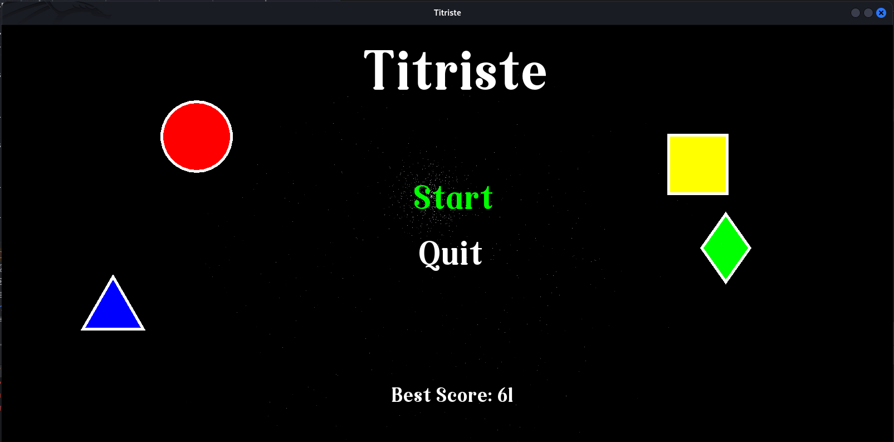

# Titriste Game 🎮

**Titriste** is a project developed in C++ as part of the Data Structures course at ENSET. It combines classic Tetris-inspired gameplay with additional strategic mechanics like color and shape-based shifts and removals. This README provides installation instructions, features, and insights into the development process.

---

  

## Features

- **ASCII Art Gameplay**: Play the game visually in the terminal with ASCII-based graphics.
- **Strategic Piece Insertion**: Insert pieces either on the left or right of the game board for optimal placement.
- **Color and Shape Matching**: Remove three consecutive pieces of the same color or shape.
- **Scoring System**: Earn points for removing pieces, with bonuses for complex actions.
- **Game Over Logic**: The game ends when more than 15 pieces are present on the board.
- **High Scores**: Scores are saved in a text file for players to track their achievements.
- **Graphical Interface**: An optional graphical version implemented using the SFML library.

---

## Getting Started

### Prerequisites

1. **C++ Compiler**: Ensure you have a compiler like `g++` installed.
2. **SFML Library**: Install the SFML library to enable graphical mode.

#### Installing SFML

- **On Linux**:
  ```bash
  sudo apt update
  sudo apt install libsfml-dev
  ```
- **On macOS**:
  ```bash
  brew install sfml
  ```
- **On Windows**:
  Download and set up SFML from [SFML's official site](https://www.sfml-dev.org/download.php).

---

### Installation

1. **Clone the Repository**:

   ```bash
   git clone https://github.com/yasser-eddouche/titriste-game.git
   cd titriste-game
   ```

2. **Compile the Game**:

   ```bash
   make
   ```

3. **Run the Game**:
   ```bash
   ./sfml-app
   ```

---

## Gameplay

  

### Controls

- **Arrow Keys**: Move and rotate pieces.
- **P**: Pause the game.
- **Q**: Quit the game.

### Objective

- Match three consecutive pieces of the same color or shape to clear them.
- Keep the board below 15 pieces to continue playing.

---

## Development Insights

### Technical Choices

- **Language**: C++ for performance and memory management.
- **Library**: SFML for graphical enhancements.
- **Data Structures**: Doubly linked lists for efficient manipulation of game pieces.

---
